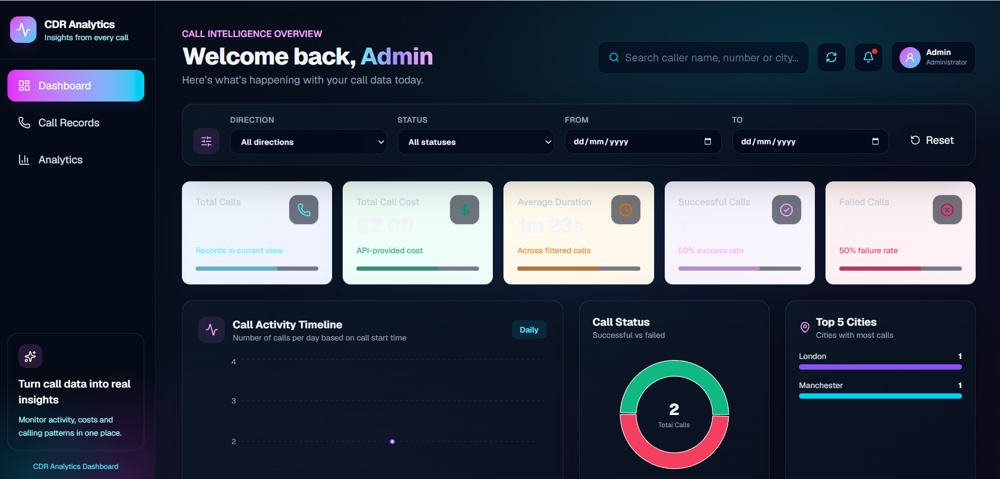

# CDR Analytics Dashboard

A full-stack Call Detail Record (CDR) analytics application built with React, Vite, Node.js, Express, and PostgreSQL.

The application provides a secure dashboard for exploring call records, monitoring call activity, and analysing call duration, cost, status, and geographic patterns.

It supports role-based access control (RBAC) for two user types: **Admin** and **Analyst**.

## Project Status

- **Local application:** Working and tested.
- **Database:** Neon PostgreSQL, populated with 10,000 CDR records.
- **Authentication:** Email/password login with bcrypt password verification and JWT authentication.
- **Role-based access:** Admin and Analyst roles implemented and tested locally.
- **Full-stack deployment:** Earlier application version deployed and tested on Vercel.
- **Latest RBAC deployment:** Pending GitHub push and production verification.

## Live Demo

**Full-stack Vercel application:**

https://cdr-analytics-dashboard-fullstack.vercel.app/

**Previous Netlify demo:**

https://samuel-cdr-analytics-dashboard.netlify.app/

> The Vercel application is the current full-stack deployment. The Netlify link is an earlier demo and may not include the PostgreSQL database, JWT authentication, or latest application changes.
>
> The Admin/Analyst changes described below have been tested locally. They must still be deployed and verified on Vercel.

## Screenshot



> Replace `docs/dashboard-preview.png` with a screenshot of the latest deployed dashboard before submission if the existing image is outdated.

## Features

### Authentication

- Email and password sign-in.
- Password hashes stored in PostgreSQL using bcrypt.
- JWT issued after successful authentication.
- User role included in the successful login response.
- Backend verification of JWTs for protected endpoints.
- Role-based API permissions using the user's current database role.
- Logout and expired-session handling in the frontend.

### Role-Based Access Control

The application supports two roles.

| Role | Access |
| --- | --- |
| Admin | Full access to the existing dashboard, raw CDR records, paginated CDR records, and analytics APIs. |
| Analyst | View-only access to aggregated call analytics. Raw CDR record endpoints are restricted. |

The backend enforces access permissions. Hiding frontend navigation alone is not used as a security control.

When a validly authenticated user requests an endpoint outside their permitted role, the backend responds with **HTTP 403 Forbidden**.

### Admin Dashboard

- Total calls.
- Total call cost.
- Average call duration.
- Successful and failed call counts.
- Daily call activity timeline.
- Call status distribution.
- Top cities by call volume.
- Search and filtering by call direction, status, and date range.

### Call Records — Admin

- Caller name and phone number.
- Receiver phone number.
- City.
- Incoming or outgoing call direction.
- Successful or failed call status.
- Call duration and cost.
- Call start time.
- Detailed call-record view.

### Analyst Analytics — View Only

The Analyst page retrieves aggregated data from the protected analytics API rather than fetching raw CDR records.

It displays:

- Total calls.
- Total call duration in seconds.
- Incoming call count.
- Outgoing call count.
- Top callers and their call counts.
- A Log out button.

The Analyst cannot access the Admin-only raw CDR endpoint.

### User Experience

- Responsive dashboard layout.
- Admin navigation between Dashboard, Call Records, and Analytics.
- Dedicated view-only analytics page for Analyst.
- Loading indicators and API error messages.
- Protected application access after login.
- Logout for both roles.

## Technology Stack

| Layer | Technology |
| --- | --- |
| Frontend | React 19, Vite 8 |
| Styling | Tailwind CSS 4 |
| UI | shadcn-style components |
| Charts | Recharts |
| Icons | Lucide React |
| Backend | Node.js, Express.js |
| Database | PostgreSQL, hosted on Neon |
| Database client | `pg` |
| Authentication | JWT, `bcryptjs` |
| Access control | Admin/Analyst RBAC |
| Data import | Excel (`xlsx`) |
| Version control | Git and GitHub |
| Full-stack hosting | Vercel |

## Project Structure

```text
CDR-ANALYTICS-DASHBOARD-FULLSTACK/
├── api/
│   └── index.js                 # Vercel API entry point
├── backend/
│   ├── data/
│   │   └── mock_call_records_10000.xlsx
│   ├── create-analyst.js        # Analyst account creation
│   ├── create-table.js          # CDR database table setup
│   ├── create-user.js           # Initial user creation
│   ├── db.js                    # PostgreSQL connection
│   ├── import-cdr.js            # CDR import utility
│   ├── import-neon.js           # Neon import utility
│   ├── server.js                # Express API, JWT authentication, RBAC
│   ├── package.json
│   └── package-lock.json
├── docs/
│   └── dashboard-preview.png
├── public/
├── src/
│   ├── components/
│   ├── lib/
│   │   ├── callUtils.js
│   │   └── utils.js
│   ├── pages/
│   │   ├── AnalyticsPage.jsx
│   │   ├── CallRecordsPage.jsx
│   │   └── DashboardPage.jsx
│   ├── services/
│   │   └── cdrApi.js
│   ├── App.jsx
│   ├── App.css
│   ├── index.css
│   └── main.jsx
├── .gitignore
├── README.md
├── index.html
├── package.json
├── package-lock.json
├── vite.config.js
└── vercel.json
```

> Local `.env` files and `node_modules` must be excluded from Git. Do not commit database credentials, JWT secrets, or account passwords.

## Database

The application uses PostgreSQL to store call records and user accounts. The deployed application connects to a Neon-hosted PostgreSQL database.

### CDR Records

The `cdr_records` table contains **10,000 imported records** from the supplied Excel dataset.

The API returns records with these fields:

| Field | Description |
| --- | --- |
| `id` | Unique record identifier |
| `callerName` | Caller name |
| `callerNumber` | Caller phone number |
| `receiverNumber` | Receiver phone number |
| `city` | City associated with the call |
| `callDirection` | Boolean direction value, formatted for display |
| `callStatus` | Boolean status value, formatted for display |
| `callDuration` | Duration in seconds |
| `callCost` | Call cost |
| `callStartTime` | Call start timestamp |
| `callEndTime` | Call end timestamp |

The frontend uses `src/lib/callUtils.js` to format these values.

### Users

The `users` table stores account details and role assignments.

| Column | Purpose |
| --- | --- |
| `id` | Unique user identifier |
| `email` | User email address |
| `password_hash` | bcrypt password hash |
| `role` | `admin` or `analyst` |
| `created_at` | Account creation timestamp |

Plain-text passwords are not stored in the database.

The `role` column was added to the existing database with `analyst` as its default. The existing administrator account was assigned the `admin` role.

## API

The Express API runs locally at `http://localhost:4000` and is available through the deployed application's `/api` routes.

### API Permissions

| Endpoint | Admin | Analyst |
| --- | --- | --- |
| `GET /api/health` | Public | Public |
| `POST /api/login` | Public | Public |
| `GET /api/cdr` | Allowed | 403 Forbidden |
| `GET /api/cdr/paginated` | Allowed | 403 Forbidden |
| `GET /api/analytics/summary` | Allowed | Allowed |

Other analytics routes should be checked for equivalent role protection before production release.

### Health Check

```http
GET /api/health
```

**Live endpoint:**

https://cdr-analytics-dashboard-fullstack.vercel.app/api/health

This public endpoint checks whether the backend is running.

Example response:

```json
{
  "success": true,
  "message": "CDR Analytics Backend is running"
}
```

### Login

```http
POST /api/login
Content-Type: application/json
```

Request body:

```json
{
  "email": "your-email@example.com",
  "password": "your-password"
}
```

A successful login returns a JWT and the authenticated user's role.

Example response structure:

```json
{
  "success": true,
  "message": "Login successful",
  "token": "<JWT>",
  "user": {
    "id": "1",
    "email": "your-email@example.com",
    "role": "admin"
  }
}
```

An Analyst login returns `"role": "analyst"`.

> Treat JWTs as credentials. Do not include real tokens in screenshots, logs, or the repository.

### Raw CDR Records — Admin Only

```http
GET /api/cdr
Authorization: Bearer <JWT>
```

This endpoint queries PostgreSQL and returns CDR records as JSON.

An Analyst attempting to access this endpoint receives HTTP 403 Forbidden.

### Paginated CDR Records — Admin Only

```http
GET /api/cdr/paginated?page=1&limit=50
Authorization: Bearer <JWT>
```

The endpoint supports pagination and optional filtering, including city and date parameters.

The pagination endpoint has been tested locally against the 10,000-record dataset.

### Analytics Summary — Admin and Analyst

```http
GET /api/analytics/summary
Authorization: Bearer <JWT>
```

This endpoint returns aggregated call analytics used by the Analyst page.

The frontend API client is implemented in `src/services/cdrApi.js`.

## Run Locally

### Prerequisites

- Node.js and npm.
- Git.
- A PostgreSQL database, such as a Neon database.
- A code editor, such as Visual Studio Code.

### 1. Clone the Repository

```bash
git clone https://github.com/Sesay-samuel/CDR-ANALYTICS-DASHBOARD-FULLSTACK.git
cd CDR-ANALYTICS-DASHBOARD-FULLSTACK
```

### 2. Install Dependencies

Install the frontend dependencies from the project root:

```bash
npm install
```

Then install the backend dependencies:

```bash
cd backend
npm install
```

### 3. Configure Environment Variables

Create `backend/.env` for local configuration. To use Neon locally, configure `NEON_DATABASE_URL` in the environment or in `backend/.env.neon`.

The application uses these environment variable names:

| Variable | Purpose |
| --- | --- |
| `NEON_DATABASE_URL` | Neon PostgreSQL connection string |
| `JWT_SECRET` | Secret used to sign and verify JWTs |
| `DB_HOST` | Local PostgreSQL host, when not using Neon |
| `DB_PORT` | Local PostgreSQL port, when not using Neon |
| `DB_NAME` | Local PostgreSQL database name |
| `DB_USER` | Local PostgreSQL user |
| `DB_PASSWORD` | Local PostgreSQL password |
| `ADMIN_EMAIL` | Email for initial account creation |
| `ADMIN_PASSWORD` | Password for initial account creation |
| `ANALYST_EMAIL` | Email for Analyst account creation |
| `ANALYST_PASSWORD` | Password for Analyst account creation |

The database connection uses `NEON_DATABASE_URL` when it is configured; otherwise, it uses the individual `DB_*` settings.

Use strong, unique account passwords of at least 12 characters and a securely generated JWT secret.

> Never commit `.env` files, passwords, connection strings, or JWT secrets. Configure production values separately in Vercel.

### 4. Prepare the Database

From the `backend` directory, create the CDR table if it does not already exist:

```bash
node create-table.js
```

Import the supplied dataset using the appropriate script for your configured database. For Neon:

```bash
node import-neon.js
```

Ensure the `users` table exists with the columns documented above, including `role`, before creating role-based accounts.

For an existing database that does not yet have a `role` column, the migration used during development was:

```sql
ALTER TABLE users
ADD COLUMN IF NOT EXISTS role VARCHAR(20) NOT NULL DEFAULT 'analyst';
```

Assign the existing administrator account the `admin` role using its email address:

```sql
UPDATE users
SET role = 'admin'
WHERE email = '<existing-admin-email>';
```

Use your actual administrator email in your database management tool. Do not commit account credentials.

### 5. Create Accounts

Create the initial account using the configured `ADMIN_EMAIL` and `ADMIN_PASSWORD`:

```bash
node create-user.js
```

For a new installation, verify that the intended administrator account has the `admin` role. The existing `create-user.js` does not explicitly assign a role, so the database default is `analyst` until the role is updated.

Create a separate Analyst account using `ANALYST_EMAIL` and `ANALYST_PASSWORD`:

```bash
node create-analyst.js
```

The Analyst creation script inserts the account with the `analyst` role.

> Do not rerun account-creation scripts for emails that already exist. Check existing records before repeating setup or import operations.

### 6. Start the Backend

From the `backend` directory:

```bash
node server.js
```

Check the health endpoint:

http://localhost:4000/api/health

Keep the backend terminal running.

### 7. Start the Frontend

Open a second terminal in the project root:

```bash
npm run dev
```

Open the URL shown by Vite, normally:

http://localhost:5173

Sign in using either the Admin or Analyst account.

- Admin loads the original dashboard and CDR records.
- Analyst loads the view-only analytics page.

## Local RBAC Verification

The following checks have been completed locally:

- [x] Existing account assigned the `admin` role.
- [x] Admin login response includes `"role": "admin"`.
- [x] Admin dashboard loads successfully.
- [x] Separate Analyst account created.
- [x] Analyst login response includes `"role": "analyst"`.
- [x] Analyst request to `GET /api/cdr` returns HTTP 403 Forbidden.
- [x] Analyst analytics page loads aggregated data.
- [x] Analyst Log out button works.
- [x] Admin dashboard and call-record functionality still work after frontend changes.

The locally tested analytics page displayed 10,000 total calls, 5,061 incoming calls, and 4,939 outgoing calls.

These checks confirm the tested local behaviour. Production RBAC verification remains pending.

## Production Build

From the project root:

```bash
npm run build
```

The production frontend is generated in `dist/`.

To preview the frontend build locally:

```bash
npm run preview
```

> The Vite preview checks the frontend build. It does not replace testing the deployed Express API, authentication, or database connection.

## Vercel Deployment

The full-stack application is deployed on Vercel:

https://cdr-analytics-dashboard-fullstack.vercel.app/

The repository includes:

- `api/index.js` as the Vercel API entry point.
- `vercel.json` with Vite build settings and API rewrites.
- A React frontend that uses relative `/api` URLs in production.

The production environment uses `NEON_DATABASE_URL` and `JWT_SECRET` in Vercel's environment variable settings.

### Earlier Deployment Verification

The following checks were completed for the earlier deployed version:

- [x] Deploy the full-stack application to Vercel.
- [x] Confirm `/api/health` returns the Express health-check JSON.
- [x] Test login on the deployed application.
- [x] Confirm the deployed application connects to PostgreSQL.
- [x] Confirm the dashboard loads successfully.

### Latest RBAC Deployment Checklist

Complete these checks after pushing the Admin/Analyst changes:

- [ ] Run `npm run build` successfully.
- [ ] Review `git status` and confirm no `.env` files or secrets are staged.
- [ ] Commit and push the updated backend, frontend, Analyst creation script, and README.
- [ ] Confirm the new Vercel deployment is Ready.
- [ ] Verify production Admin login and dashboard access.
- [ ] Verify production Analyst login and analytics access.
- [ ] Verify production Analyst access to `/api/cdr` returns 403 Forbidden.
- [ ] Verify all other protected routes have the intended role restrictions.
- [ ] Verify logout for both roles.

**Latest RBAC deployment status: Pending production verification.**

## GitHub Repository

https://github.com/Sesay-samuel/CDR-ANALYTICS-DASHBOARD-FULLSTACK

## Author

**Samuel Sesay**